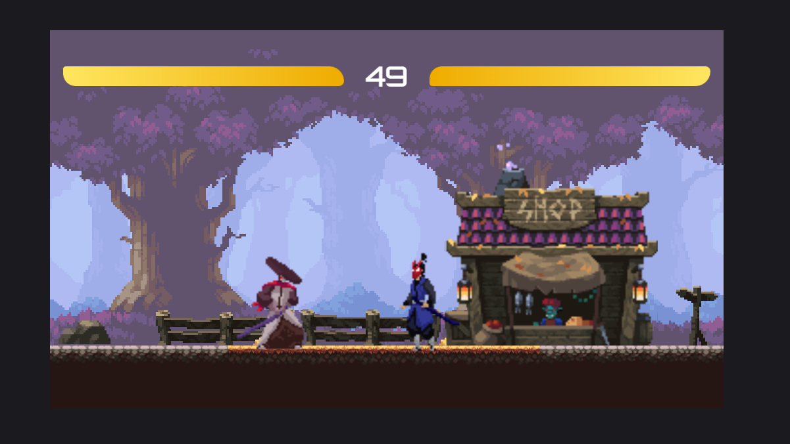

<h1 align="center">
     Pixel Art Game
</h1>

<h3 align="center">
    Pixel Art Game
</h3>

<p align="center">
  

  
  
  <a href="https://github.com/Agencia-CodeX/pixel-art-game/commits/main">
    
  </a>
    
   
  
  
  
 
</p>

<h4 align="center">
	🚧   Completed 🚀 🚧
</h4>

## 💻 About the project

Pixel Art Game - it's a 2d fighting game.

---

## ⚙️ Functionalities

- [x] You can run.
- [x] You can jump.
- [x] You can attack.
---

## 🎨 Layout



---

## 🚀 How to run the project

### Pré-requisitos

it's good to have an editor to work with the code like [VSCode](https://code.visualstudio.com/)

#### 🎲 Running

```bash

# Clone this repository
$ git clone https://github.com/Agencia-CodeX/pixel-art-game.git

# Access the project folder in terminal/cmd
$ cd pixel-art-game

# And just open the index.html file in the browser

```

---

## 🛠 Technologies

The following tools were used in building the project:

#### **Website**  ([HTML]  + [Css]+ [Javascript])


## 🦸 Author


 <br />
 <sub><b>CodeX Agency</b></sub></a> 🚀
 <br><br>

[](miguelmarcola@gmail.com)

---

## 📝 Licença

This project is under license [MIT](./LICENSE).

Made with great dedication by CodeX Agency 👋🏽 [Contact!](https://www.linkedin.com/in/miguel-mar%C3%A7ola-28535a151/)

---